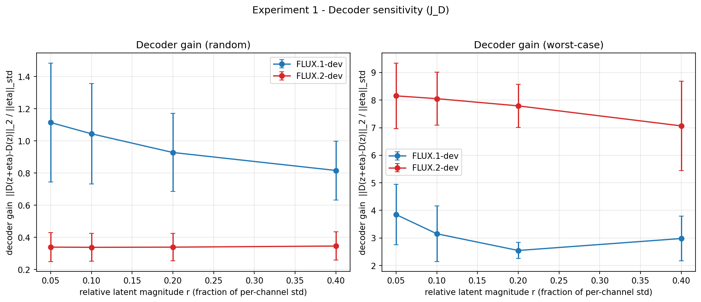
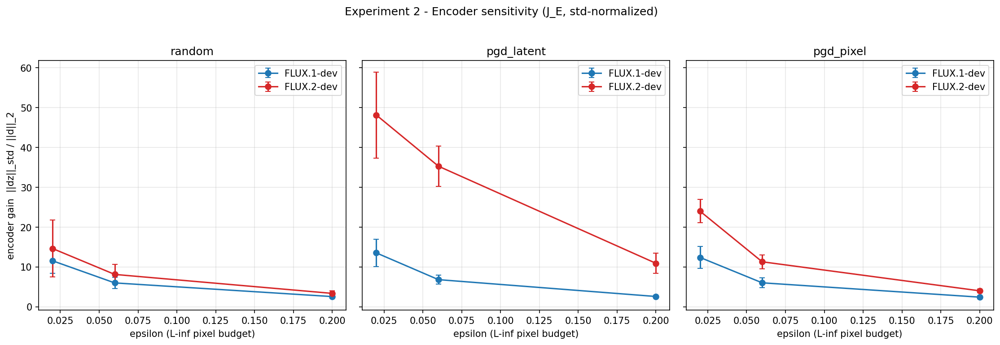
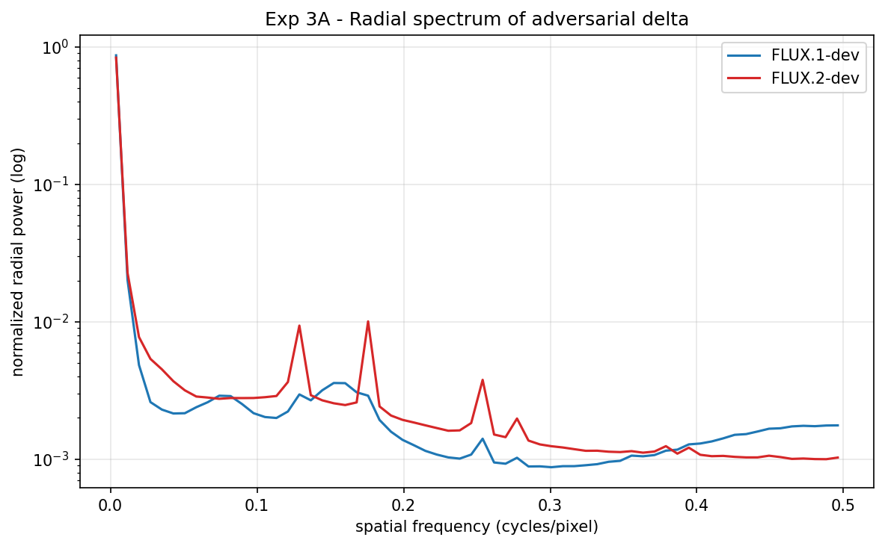
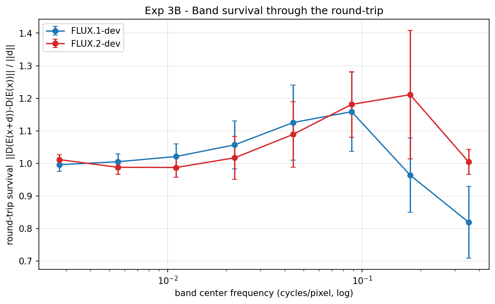

# Jacobian Experiments: Isolating Encoder vs Decoder Sensitivity

> **Companion to** `experiments_spec.md` (the design), `understanding_vae_robustness.md`
> (the `J_D · J_E` framing), and `flux1_vs_flux2_vae_report.md` (the round-trip results).
>
> These three experiments take the *inferred* Jacobian story — that
> `decoded_diff_mse ≈ ‖J_D · J_E · δ‖` and that FLUX.1 wins on **both** factors —
> and turn it into **measurement**, separating the encoder factor (`J_E`) from the
> decoder factor (`J_D`) that the round-trip metric conflates.

## Setup

- **VAEs:** `AutoencoderKL` (FLUX.1-dev, 16 latent channels) and
  `AutoencoderKLFlux2` (FLUX.2-dev, 32 latent channels), loaded with
  `subfolder="vae"`, on CUDA in fp32. No `scaling_factor`/`shift_factor`, no
  FLUX.2 pipeline BatchNorm/packing — the attacked `encode().latent_dist.mode()`
  → `decode().sample` round-trip only.
- **Images:** `resources/test-images` (n=5), 512×512 in `[-1, 1]`.
- **Fairness:** pixel/output quantities compared directly (RGB, same units);
  latent quantities **normalized per-channel by each channel's clean std `s_c`**,
  so a "unit" perturbation means the same thing for 16-ch and 32-ch latents.
  Identical ε / image set / iteration counts across both models.
- **Scripts:** `experiments/decoder_sensitivity.py`,
  `experiments/encoder_sensitivity.py`, `experiments/frequency_analysis.py`
  (shared helpers in `experiments/vae_common.py`). Raw JSON + plots under
  `results/jacobian/{decoder,encoder,freq}/`.

All numbers below are mean ± std over the 5 images.

---

## Experiment 1 — Decoder sensitivity (`J_D`)

Perturb the latent directly (`z + η`) with budget in std-normalized units
(`η[:,c] = r · s_c · noise`) and measure the pixel response gain
`‖D(z+η) − D(z)‖₂ / ‖η‖_std`, for random directions (N=16) and the worst-case
direction (10-step power iteration ≈ top singular value of `J_D`).

| r | FLUX.1 random | FLUX.2 random | FLUX.1 worst-case | FLUX.2 worst-case |
|---|---:|---:|---:|---:|
| 0.05 | 1.11 ± 0.37 | 0.34 ± 0.09 | 3.85 ± 1.09 | **8.15 ± 1.19** |
| 0.10 | 1.05 ± 0.31 | 0.34 ± 0.09 | 3.15 ± 1.01 | **8.05 ± 0.96** |
| 0.20 | 0.93 ± 0.24 | 0.34 ± 0.09 | 2.55 ± 0.29 | **7.79 ± 0.79** |
| 0.40 | 0.82 ± 0.18 | 0.35 ± 0.09 | 2.98 ± 0.81 | **7.07 ± 1.62** |

**Verdict: hypothesis holds for the worst case, and is *reversed* for random
directions — exactly the "watch for" scenario in the spec.**

- On **random** normalized latent noise, FLUX.2's decoder is *less* sensitive
  (~0.34 vs ~1.0). With 32 channels, a unit-std random kick spreads its energy
  over twice as many latent directions, most of which the decoder treats as
  benign — so on average it amplifies *less* than FLUX.1's.
- On the **worst-case** direction, FLUX.2's decoder gain is ~2.5× FLUX.1's
  (~8 vs ~3) and roughly flat across r. The decoder is not globally sharper; it
  is far more **anisotropic**. The worst-case / random ratio is ~24× for FLUX.2
  (8.1 / 0.34) versus ~3× for FLUX.1 (3.2 / 1.0): FLUX.2 has many benign latent
  directions plus a few very sharp ones an attacker can steer into. This is the
  precise form of "the high-fidelity decoder amplifies" — it amplifies the
  *adversarially chosen* direction, not random latent noise.

---

## Experiment 2 — Encoder sensitivity (`J_E`)

Std-normalized latent movement per unit pixel nudge,
`encoder_gain = ‖(E(x+δ) − E(x)) / s_c‖₂ / ‖δ‖₂`, for random (N=16), PGD-latent
(worst-case encoder direction), and PGD-pixel (full round-trip adversary)
directions at the repo's ε grid.

| ε | dir | FLUX.1 gain | FLUX.2 gain | FLUX.2 / FLUX.1 |
|---|---|---:|---:|---:|
| 0.02 | random | 11.6 ± 3.1 | 14.6 ± 7.2 | 1.3× |
| 0.02 | PGD-latent | 13.5 ± 3.4 | **48.1 ± 10.8** | **3.6×** |
| 0.02 | PGD-pixel | 12.4 ± 2.8 | **24.0 ± 2.9** | **1.9×** |
| 0.06 | random | 6.0 ± 1.4 | 8.1 ± 2.5 | 1.4× |
| 0.06 | PGD-latent | 6.8 ± 1.1 | **35.3 ± 5.0** | **5.2×** |
| 0.06 | PGD-pixel | 6.0 ± 1.2 | **11.3 ± 1.7** | **1.9×** |
| 0.20 | random | 2.6 ± 0.4 | 3.4 ± 0.7 | 1.3× |
| 0.20 | PGD-latent | 2.6 ± 0.3 | **10.9 ± 2.5** | **4.2×** |
| 0.20 | PGD-pixel | 2.4 ± 0.4 | **4.0 ± 0.5** | **1.7×** |

**Verdict: hypothesis holds, and strongly.** For **random** pixel directions the
two encoders move their (normalized) latents by comparable amounts — the
bottleneck does *not* shrink generic noise more in one model than the other.
The gap opens only for **adversarial** directions: the worst-case encoder
direction (PGD-latent) moves FLUX.2's latent **3.6–5.2× further** in std-units
than FLUX.1's, and the actually-damaging PGD-pixel direction ~1.9×. This is the
fair, per-std version of the report's hint that FLUX.2's `latent_linf` under
attack is larger — once normalization removes the trivial scale difference, the
encoder gap survives and is specifically an **adversarial-direction** gap. FLUX.1's
tighter bottleneck really does shrink the adversarial pixel perturbation; FLUX.2's
roomier latent passes it through.

### Combining Exp 1 × Exp 2 (the `J_D · J_E` product)

`decoded_diff_mse` should track `(encoder gain) × (decoder gain)`. The product of
the two **independently measured** worst-case-ish factors versus the **measured**
round-trip pixel gain (`‖D(E(x+δ)) − D(E(x))‖₂ / ‖δ‖₂`) for the PGD-pixel
adversary at ε = 0.06:

| | encoder gain (PGD-pixel) | × decoder worst-case (r=0.1) | = product | measured round-trip gain |
|---|---:|---:|---:|---:|
| FLUX.1 | 6.04 | 3.15 | 19.0 | 2.51 |
| FLUX.2 | 11.32 | 8.05 | 91.1 | 12.82 |
| **FLUX.2 / FLUX.1** | **1.9×** | **2.6×** | **4.8×** | **5.1×** |

The absolute product overshoots the measured round-trip gain (the encoder's worst
direction and the decoder's worst direction are not perfectly aligned, and a
local linearization ignores saturation), but the **model-to-model ratio of the
product (4.8×) matches the ratio of the measured round-trip gain (5.1×) almost
exactly.** The round-trip vulnerability gap factorizes into an encoder gap
(~1.9×) times a decoder gap (~2.6×), both of which we measured separately — the
two Jacobian factors point the same way and multiply, as the chain-rule story
predicts. (Correspondingly the raw `decoded_diff_mse` ratio FLUX.2/FLUX.1 is
~47× at ε=0.02, ~28× at ε=0.06, ~9× at ε=0.20 in MSE units — same direction as
the report's 30-image sweep.)

---

## Experiment 3 — Frequency analysis

### Part A — spectrum of the adversarial δ

Radially-averaged power spectrum of the regenerated PGD-pixel δ (ε = 0.06),
normalized per curve to compare shape.

**Verdict: not discriminative.** Both models' effective δ are broadband but
dominated by low/mid frequencies, with nearly identical high-frequency tails
(fraction of power above 0.25 cyc/px ≈ 0.04 for *both*). So the difference is
**not** that FLUX.2's adversarial δ is more high-frequency in absolute terms —
the raw perturbations look spectrally similar. What differs is how the round-trip
*treats* each frequency band, which Part B isolates directly.

### Part B — band-survival round-trip probe

Band-limited unit perturbations (8 log-spaced radial frequency rings, fixed pixel
norm, identical δ for both models) pushed through the round-trip:
`survival(band) = ‖D(E(x+δ_band)) − D(E(x))‖ / ‖δ_band‖`.

| band center (cyc/px) | 0.003 | 0.006 | 0.011 | 0.022 | 0.044 | 0.088 | 0.177 | 0.354 |
|---|---:|---:|---:|---:|---:|---:|---:|---:|
| FLUX.1 survival | 1.00 | 1.01 | 1.02 | 1.06 | 1.13 | 1.16 | 0.96 | **0.82** |
| FLUX.2 survival | 1.01 | 0.99 | 0.99 | 1.02 | 1.09 | 1.18 | **1.21** | **1.00** |

**Verdict: hypothesis holds — this is the cleanest evidence for the sieve.** Both
curves agree at low/mid frequency (and both slightly *amplify* the mid band
~0.09 cyc/px). They diverge exactly at high frequency: above ~0.1 cyc/px FLUX.1's
survival **falls below 1 and keeps dropping** (0.96 then 0.82 near Nyquist),
while FLUX.2 **stays at or above 1** (1.21 then 1.00). FLUX.1's round-trip acts
as a low-pass filter that attenuates the high-frequency perturbations an attacker
would prefer; FLUX.2 passes — and at 0.18 cyc/px even amplifies — the same bands.
That is the bottleneck-as-sieve mechanism, measured directly.

---

## Summary

| Claim (from the explainer) | Test | Result |
|---|---|---|
| High-fidelity decoder amplifies (`J_D` larger for FLUX.2) | Exp 1 | **Holds for worst-case (~2.5×); reversed for random noise.** FLUX.2's decoder is flatter on average but far more anisotropic. |
| Tighter bottleneck shrinks adversarial δ (`J_E` smaller for FLUX.1) | Exp 2 | **Holds strongly for adversarial directions (~1.9–5.2×); comparable for random.** |
| Round-trip gap = product of the two factors | Exp 1 × 2 | **Holds:** product ratio 4.8× ≈ measured round-trip ratio 5.1×. |
| Sieve = low-pass filter | Exp 3B | **Holds:** FLUX.1 attenuates high-freq bands (survival → 0.82), FLUX.2 preserves them (→ 1.00–1.21). |
| Adversarial δ is intrinsically more high-freq for FLUX.2 | Exp 3A | **Not supported:** raw δ spectra are similar; the difference is in the round-trip's frequency response, not the attack's spectrum. |

**Refined picture.** The robustness gap is genuinely a **product of two
adversarial-direction effects**, both favoring FLUX.1, and both invisible to
*random* probes: FLUX.1's encoder moves its latent less along the worst-case
pixel direction (a per-std-fair ~1.9× encoder advantage), and FLUX.1's decoder
amplifies the worst-case latent direction less (~2.5×). The mechanism is
frequency-selective: FLUX.1's tighter bottleneck behaves as a low-pass filter
that suppresses exactly the high-frequency content an L∞ attack relies on, while
FLUX.2's roomier 32-channel latent passes it through to a more anisotropic
decoder. Crucially, none of this shows up for random perturbations — it is
specifically the **attacker-chosen** directions where FLUX.2 is fragile, which is
why the clean reconstruction quality (better for FLUX.2) and the adversarial
robustness (better for FLUX.1) point in opposite directions.

### Caveats

- n = 5 images; ranges are wide (see ± std and per-image JSON). Directions and
  ratios are stable across images, but absolute magnitudes vary. Re-run with
  `--input_dir resources/test-images-imagenet25` for n=25 to tighten the bars.
- The decoder "worst-case" is a 10-step power-iteration estimate of the top
  `J_D` singular value in std-normalized coordinates — a lower bound on the true
  top singular value.
- The product check uses the worst-case decoder gain as a stand-in for the
  decoder's response along the encoder's adversarial output direction; it
  predicts the *ratio* well but overshoots absolute magnitude because those two
  worst-case directions are not perfectly aligned.
